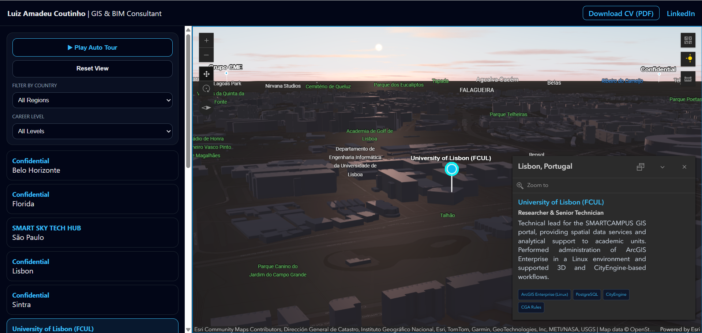

# 🗺️ 3D Geospatial Career Portfolio
### Interactive GeoBIM & GIS Showcase | Luiz Amadeu Coutinho

This project is a high-fidelity 3D geospatial application built with the **ArcGIS Maps SDK for JavaScript**. It serves as an interactive curriculum vitae, visualizing over 20 years of global experience in GIS, GeoBIM, and Reality Capture across Brazil, USA, Portugal, Angola, South Africa, and Ireland.

## 🌐 Live Demo
Experience the interactive globe here:  
👉 **[https://amadeuvix-gis.github.io/3d-geospatial-cv-/](https://amadeuvix-gis.github.io/3d-geospatial-cv-/)**

---

## 📸 Application Preview

*Professional 3D interface featuring global career milestones and technical stack visualization.*

---

## 🚀 Key Technical Features

### 1. Dynamic 3D Navigation
- **Automated Career Tour:** An optimized "instant-start" navigation system that flies the camera through professional milestones with specific tilt and heading adjustments for 3D urban context.
- **Responsive Camera Offsets:** Advanced logic that adjusts the focal point based on the device (Mobile vs. Desktop) to ensure visibility above UI overlays.

### 2. Advanced Data Filtering
- **Bi-directional Sync:** Filtering by Country or Career Level updates both the sidebar list and the map features simultaneously.
- **SQL-based Expressions:** Utilizes `definitionExpression` to physically filter GeoJSON features on the client-side, ensuring a clean and focused map view.

### 3. Professional UX/UI
- **Mobile-First Approach:** A custom "Bottom Sheet" layout for mobile devices with a toggleable (**Minimize/Maximize**) sidebar to maximize map real estate.
- **Custom Theming:** Dark-mode interface with customized ArcGIS widgets including **Daylight**, **Basemap Gallery**, and **Measurement Tools**.

---

## 🛠️ Technology Stack
- **Engine:** [ArcGIS Maps SDK for JavaScript v4.29](https://developers.arcgis.com/javascript/latest/)
- **Frontend:** HTML5, CSS3 (Modular with Media Queries), Vanilla JavaScript (ES6+)
- **Data:** Standalone GeoJSON dataset for decoupled data management.
- **Deployment:** GitHub Pages.

---

## 📂 Project Structure
```text
3d-geospatial-cv/
├─ index.html           # Main entry point and UI structure
├─ css/
│  └─ style.css         # Custom responsive styles and ArcGIS overrides
├─ js/
│  └─ main.js           # Application logic, map controllers, and tour functions
├─ data/
│  └─ career.geojson    # Decoupled spatial dataset
├─ assets/
│  ├─ Picture1.jpg      # Profile photography
│  ├─ screenshot.png    # App preview for README
│  └─ [CV_File].pdf     # Downloadable professional resume
└─ README.md            # Project documentation
🔧 Installation & Local Development
Clone the repository:

Bash

git clone [https://github.com/amadeuvix-gis/3d-geospatial-cv-.git](https://github.com/amadeuvix-gis/3d-geospatial-cv-.git)
Run the project using a local server to avoid CORS issues:

Using VS Code: Right-click index.html -> Open with Live Server.

Using Python: python -m http.server 8000.
